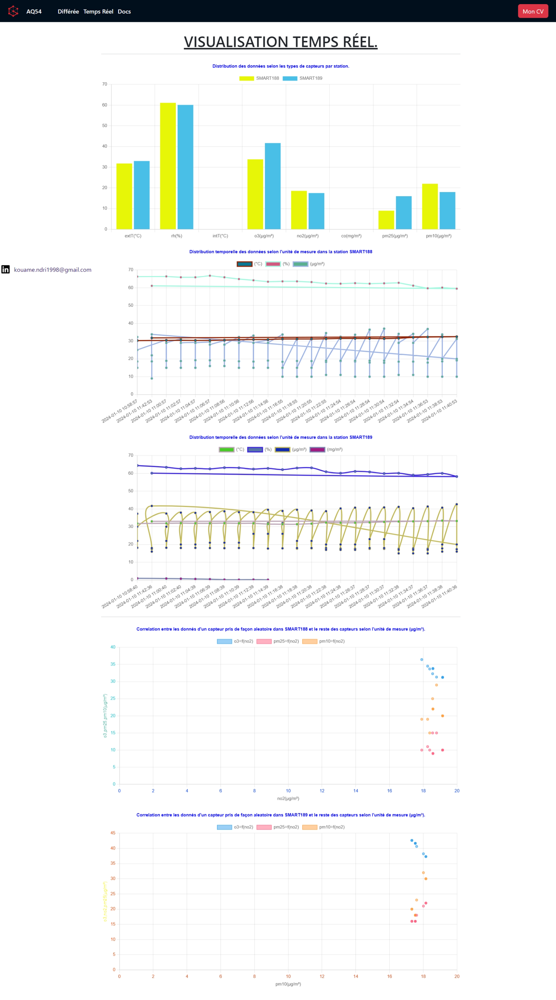

# AQ54 Data Visualization App with Angular and Docker-Compose and Nodejs

## Overview

This repository contains the source code and configurations for AQ54 data visualization app built with Angular, Docker-Compose,
 Node.js, and the AirQuino API. The app is designed to fetch and display air quality data in a visually appealing manner.

## Prerequisites

Before running the application, make sure you have the following software installed on your machine:

- [Docker](https://www.docker.com/)
- [Docker-Compose](https://docs.docker.com/compose/)
- [Node.js](https://nodejs.org/)(version 16 or latest)
- [Angular](https://github.com/angular/angular-cli) (version 12.2.18)
- Code editor of your choice (e.g., Visual Studio Code)  

## Getting Started

1. Clone the repository:

   ```bash
   git clone https://github.com/NdriAriel/technical-challenge-data354.git
   cd technical-challenge-data354
   ```

2. Install Angular CLI globally:

   ```bash
   npm install -g @angular/cli@12
   ```

3. Install project dependencies:

   ```bash
   cd technical-challenge-data354
   npm install
   ```

4. Build the Angular app:

   ```bash
   ng build
   ```

5. Start the Docker containers:

   ```bash
   docker-compose up -d
   ```

6. Open your web browser and navigate to [http://localhost:8080](http://localhost:8080) to access the Data Visualization App.

## Project Structure  


  


## AQ54 Data visualisation app user interface



  

## Docker-Compose Configuration

The `docker-compose.yml` file defines the services, networks, and volumes needed for the application. It includes the following services:

- **web-app**: Angular app service.
- **nginx**: Nginx web server for serving the Angular app.
- **api**: Placeholder for any backend API service.
- **database**: Placeholder for any backend database service.

## Development Workflow

1. Make changes to the Angular app source code in the `src/` directory.

2. Rebuild the Angular app:

   ```bash
   ng build
   ```

3. Restart the Docker containers:

   ```bash
   docker-compose restart web-app
   ```

4. Access the updated app at [http://localhost:8080](http://localhost:8080).

## Maintenance and Support

For additional information or support, please contact the maintainers of this repository:

- David Kouamé N'DRI <kouame.ndri1998@gmail.com>

## License

This project is licensed under the MIT License - see the [LICENSE](LICENSE) file for details.
